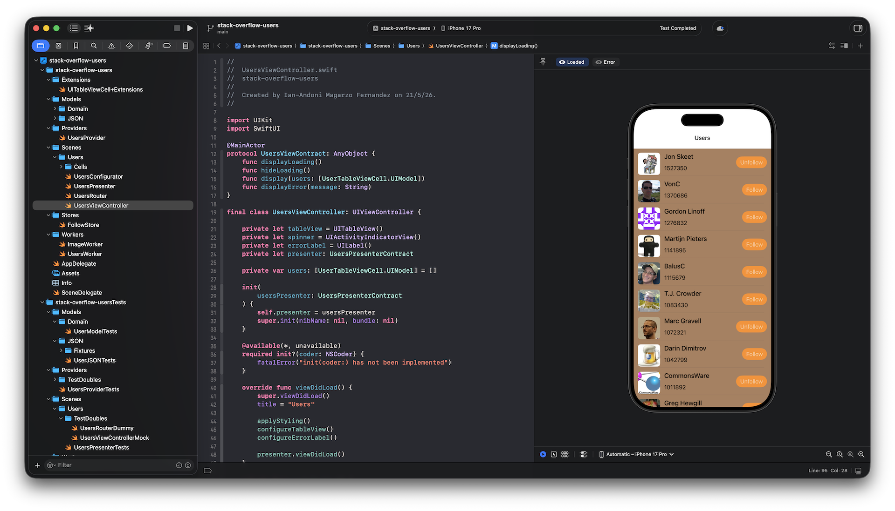

# stack-overflow-users-ios

## Description 
Develop an iOS application that fetches a list of StackOverflow users and displays it in a list on the screen.

- UKit technical test

## How to run

You can run the project on an Xcode simulator, or open `UsersViewController` canvas to load a preview.

## Architecture

Usage of VIPER (lite) architecture without interactor to avoid unnecesary boilerplate code.Ni

## Design

### Icon
Design basic icon with Sketch, using an SVG logo.

### Accent colour
Get colour ideas from Stack Overflow blog: https://stackoverflow.blog/2025/07/10/vote-on-our-new-identity/

## Future improvements

### Pagination 
When the table view scrolls to display the latest fetched user, the next page load should be triggered (e.g. via `tableView(_:willDisplay:forRowAt:)` checking the last index). The Stack Exchange API already supports `page` and `pagesize` query parameters, so this is a `UsersProvider` + `UsersWorker` concern, not a UI one.

Also, switching the data source to `UITableViewDiffableDataSource` would provide free animation for inserts of new pages, and reduce re-rendering the whole table when toggling follows.

### AsyncThrowingStream
If follow user state ever needs to change from outside this screen (e.g. push notifications, background sync), `UsersProvider.getUsers()` could be reshaped to return an `AsyncThrowingStream<[UserModel], Error>` so the `UsersPresenter` would receive automatic updates. Today's scope doesn't require it.
